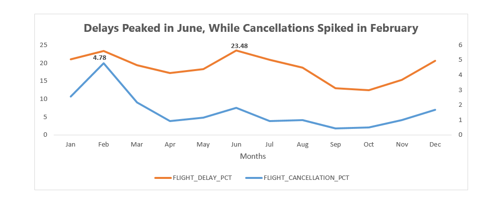
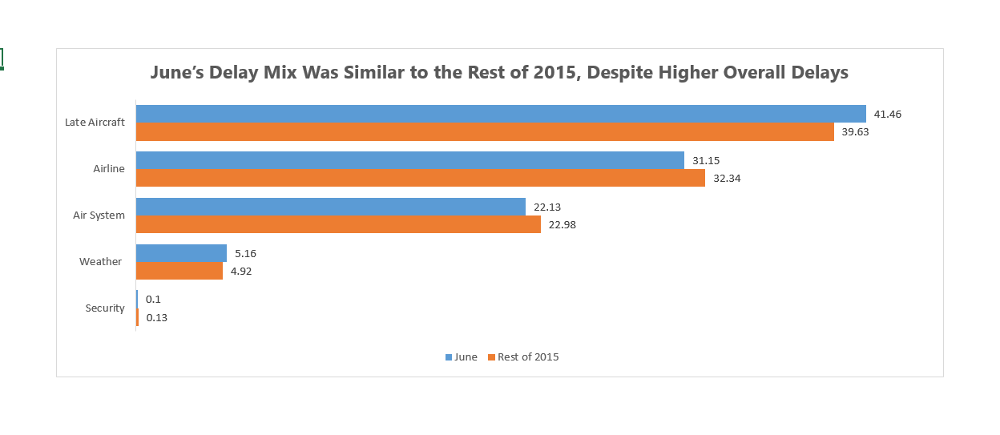
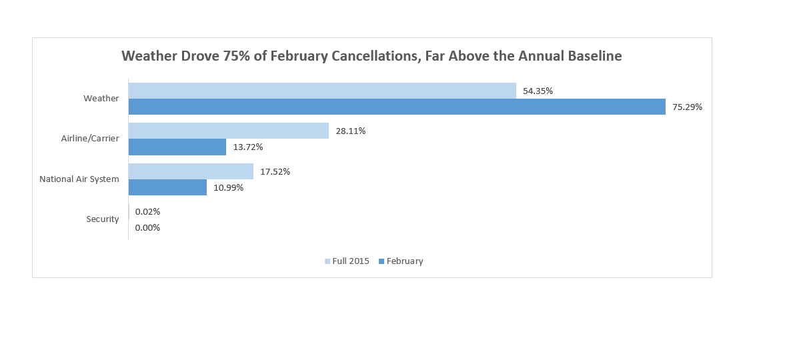
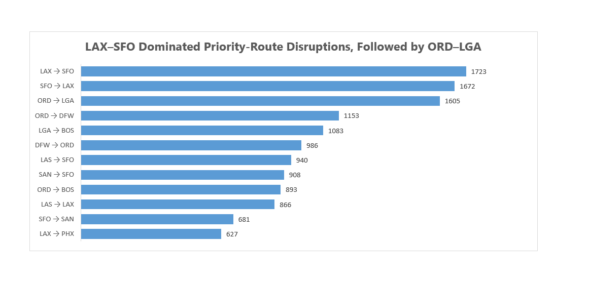

# U.S. Airline Flight Delays Analysis

SQL analysis of 2015 U.S. airline flight delays, cancellations, disruption drivers, and route reliability, with Excel visuals highlighting operational risks and priority routes for improvement.

## Key Findings

- **Delay and cancellation risk peaked at different times.** June had the highest delay rate at **23.48%**, while February had the highest cancellation rate at **4.78%**. This suggests the two peak periods were driven by different operational problems and should not be treated as one generic disruption issue.

- **June's delay problem was dominated by late-aircraft and carrier-related delay minutes.** Late-aircraft delay represented **41.46%** of June delay minutes and airline/carrier delay another **31.15%**, together accounting for **72.61%**.

- **June was worse mainly because disruption was larger in scale, not because the cause mix changed dramatically.** Late-aircraft delay represented **41.46% in June versus 39.63% during the rest of 2015**, while the other major cause shares were also broadly similar. At the same time, June recorded **3.06 million late-aircraft delay minutes**, around **53.45% higher** than the average month across the other eleven months.

- **February's cancellation spike was unusually weather-heavy.** Weather accounted for **75.29% of February cancellations versus 54.35% across 2015**. Carrier-related cancellations fell to **13.72% from a 28.11% annual share**, and National Air System cancellations fell to **10.99% from 17.52%**, pointing to weather as the distinguishing feature of February.

- **ORD → LGA was the least reliable high-volume route by major disruption rate.** It recorded a **15.30% major disruption rate**, representing **1,605 disrupted flights out of 10,492 scheduled flights**.

- **A high disruption rate alone was not enough to classify a route as a priority.** For example, BOS → LGA had a **14.33%** major disruption rate, but this was slightly below the **14.47% LGA destination baseline**. Comparing routes with airport baselines helps avoid treating broader airport-level problems as route-specific failures.

- **LAX → SFO and SFO → LAX created the largest operational impact among the priority routes**, with **1,723** and **1,672** major disrupted flights respectively. Both routes also performed worse than their origin and destination airport baselines.

- **SAN → SFO showed one of the clearest route-specific underperformance signals.** Its **11.91%** major disruption rate was **5.37 percentage points above the SAN origin baseline** and **1.28 points above the SFO destination baseline**.

## Recommendations

1. **Prioritize LAX → SFO, SFO → LAX, ORD → LGA and ORD → DFW for deeper operational review.**  
   These routes combine high scheduled volume, substantial disruption counts, and performance below both their origin and destination airport baselines. They offer the strongest starting point for route-level reliability improvement.

2. **Investigate aircraft rotation and turnaround processes behind late-aircraft delay propagation.**  
   June's late-aircraft delay minutes were about **53.45% above the average of the other eleven months**. Review inbound aircraft lateness, turnaround buffers, schedule recovery time and aircraft rotations to identify where earlier delays are carrying into later flights.

3. **Strengthen February weather contingency planning, starting with the airports carrying the largest cancellation burden.**  
   Weather accounted for **75.29% of February cancellations**. Dallas/Fort Worth recorded **2,000 February cancellations** and Chicago O'Hare **1,699**, making these logical locations for reviewing weather-related capacity, recovery and rebooking plans.

4. **Use baseline-adjusted route monitoring instead of ranking routes on raw disruption rate alone.**  
   Track each route's disruption rate alongside its origin and destination airport baselines. This helps separate route-specific underperformance from disruption that is primarily associated with the wider airport environment.

5. **Evaluate both disruption volume and disruption rate when allocating improvement effort.**  
   LAX → SFO produced the most major disrupted flights among priority routes, while ORD → LGA had the highest major disruption rate. Using only one measure could mis-prioritize operational resources.

6. **Maintain a major-disruption KPI alongside the standard 15-minute delay KPI.**  
   A combined measure covering cancellations, diversions and delays of at least 60 minutes highlights the failures with the greatest operational impact and provides a stronger prioritization signal than standard delay rate alone.

> **Interpretation note:** These recommendations identify where further operational investigation is most justified. The analysis is observational and does not by itself establish the causal mechanism behind each disruption.

## Project Overview

This project analyzes 2015 U.S. airline flight operations to identify when disruption was most severe, what caused it, where it was concentrated, and which high-volume routes should be prioritized for reliability improvement.

The analysis moves from broad network performance to increasingly specific operational questions:

1. Validate and clean the flight data.
2. Establish network, airline and airport baselines.
3. Analyze monthly delay and cancellation patterns.
4. Investigate the drivers behind the June delay spike and February cancellation spike.
5. Evaluate route reliability and identify high-impact priority routes.

The project is intentionally SQL-first. Excel is used only to present a small number of decision-focused visuals.

## Visual Insights

### 1. Monthly delay and cancellation trends



**Insight:** Delays peaked in June, while cancellations spiked in February, pointing to different seasonal disruption patterns.

### 2. June delay-cause mix vs rest of 2015



**Insight:** June's cause mix remained broadly similar to the rest of the year, while total late-aircraft delay minutes rose sharply. The problem was therefore more about disruption scale than a new dominant cause.

### 3. February cancellation reasons vs annual baseline



**Insight:** Weather accounted for roughly three-quarters of February cancellations and took a much larger share than the annual baseline, making it the clearest differentiator of the February spike.

### 4. Priority routes for reliability improvement



**Insight:** LAX → SFO and SFO → LAX produced the largest number of major disruptions among priority routes, while ORD → LGA combined high disruption volume with the highest major disruption rate among high-volume routes.

## Business Questions

The analysis was designed around the following questions:

- How reliable was the network overall?
- Which airlines and airports contributed most to disruption?
- How did delay and cancellation performance change through the year?
- What drove June's unusually poor delay performance?
- Why did February experience the highest cancellation rate?
- Which high-volume routes had the highest delay, severe-delay and cancellation rates?
- Which routes had the highest major disruption rates?
- Were poorly performing routes simply reflecting weak origin or destination airports, or were they underperforming their airport baselines?
- Which high-volume routes should be prioritized for reliability improvement?

## Metric Definitions

To keep the analysis consistent, the project uses the following definitions:

- **Delay:** arrival delay of at least 15 minutes on a completed, non-diverted flight.
- **Severe delay:** arrival delay of at least 60 minutes on a completed, non-diverted flight.
- **Cancellation rate:** cancelled flights divided by all scheduled flights.
- **Delay rate:** delayed flights divided by completed, non-diverted flights.
- **Severe-delay rate:** severely delayed flights divided by completed, non-diverted flights.
- **Major disruption:** cancellation, diversion, arrival delay of at least 60 minutes, or departure delay of at least 60 minutes.
- **Major disruption rate:** major disrupted flights divided by all scheduled flights.
- **High-volume route:** a directional origin → destination route at or above the 99th percentile of annual scheduled route volume.

## Route Prioritization Method

A route is treated as a priority candidate when it:

1. falls within the high-volume route group,
2. has a major disruption rate above its origin airport baseline, and
3. has a major disruption rate above its destination airport baseline.

Priority routes are then ranked by the **number of major disrupted flights** to emphasize operational impact.

This method prevents a route from being prioritized solely because it operates through a generally disruption-prone airport.

## Analysis Workflow

### 01. Data Quality

[`sql/01_data_quality.sql`](sql/01_data_quality.sql)

Validates the raw flight data, reviews missing values and anomalies, and prepares the cleaned analytical dataset.

### 02. Network Baseline

[`sql/02_network_baseline.sql`](sql/02_network_baseline.sql)

Establishes network-level, airline-level and airport-level performance baselines.

### 03. Temporal Performance

[`sql/03_temporal_performance.sql`](sql/03_temporal_performance.sql)

Examines monthly delay, cancellation and severe-delay patterns to identify the periods requiring deeper investigation.

### 04. Disruption Drivers

[`sql/04_disruption_drivers.sql`](sql/04_disruption_drivers.sql)

Investigates the causes behind June's delay deterioration and February's cancellation spike, including airline, airport and disruption-cause concentration.

### 05. Route Reliability Analysis

[`sql/05_route_reliability_analysis.sql`](sql/05_route_reliability_analysis.sql)

Evaluates high-volume routes, compares route reliability with origin and destination airport baselines, and identifies priority routes for operational improvement.

## Tools

- **SQL** for cleaning, validation, aggregation, benchmarking and route-level analysis
- **Excel** for the final portfolio visuals
- **Git / GitHub** for project version control and presentation

## Dataset

The analysis uses the **2015 U.S. airline flight delays dataset**, containing scheduled flight activity together with airline, airport, delay, cancellation and diversion information.

The raw dataset is not stored in this repository. The repository focuses on the analytical SQL, outputs and visual findings.

## Repository Structure

```text
us-airline-flight-delays-analysis/
│
├── sql/
│   ├── 01_data_quality.sql
│   ├── 02_network_baseline.sql
│   ├── 03_temporal_performance.sql
│   ├── 04_disruption_drivers.sql
│   └── 05_route_reliability_analysis.sql
│
├── visuals/
│   ├── 01_monthly_delay_cancellation_trends.png
│   ├── 02_june_delay_mix_vs_rest_of_2015.png
│   ├── 03_february_cancellation_reason_comparison.png
│   └── 04_priority_routes_reliability_impact.png
│
└── README.md
```

## Project Takeaway

The analysis points to three distinct operational stories: June experienced a broad increase in delay scale led by late-aircraft and carrier-related minutes; February's cancellation spike was disproportionately weather-driven; and a subset of high-volume routes underperformed even after accounting for their origin and destination airport baselines.

The practical implication is that reliability improvement should be targeted rather than network-wide: investigate delay propagation in June, strengthen weather resilience around February's highest-burden airports, and prioritize route-level intervention where both disruption impact and baseline-adjusted underperformance are high.
